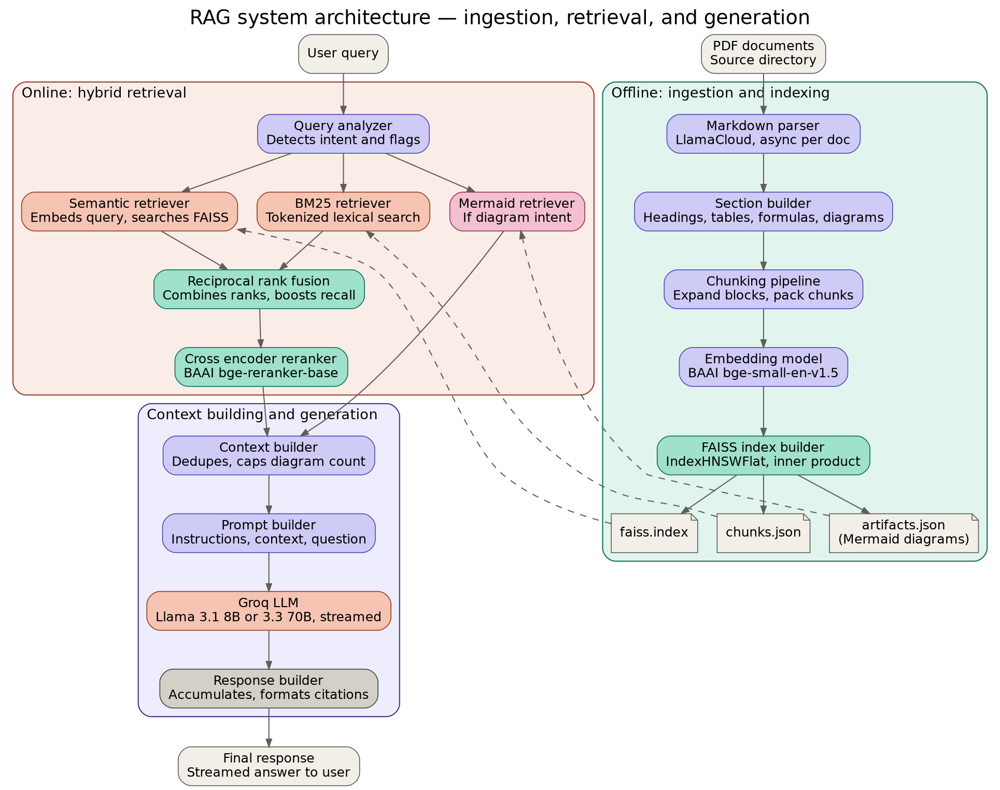

<p align="center">
  
</p>

<h1 align="center">LOTUS Engine</h1>

<p align="center">
  <strong>A Structure-Aware Hybrid Retrieval Engine for Retrieval-Augmented Generation (RAG)</strong>
</p>

<p align="center">
  Hybrid Retrieval • Structure-Aware Chunking • Cross-Encoder Reranking • Artifact Retrieval
</p>


------------------------------------------------------------------------

## Overview

LOTUS Engine is a modular retrieval engine designed for long-form
technical documents.

Instead of treating documents as flat streams of text, LOTUS preserves
semantic structure throughout ingestion and retrieval. It combines
structure-aware chunking, hybrid search (Dense + BM25), Reciprocal Rank
Fusion (RRF), cross-encoder reranking, and artifact-aware retrieval to
produce high-quality context for Large Language Models.

> **Design Philosophy:** Documents should be represented as structured
> knowledge---not as disconnected token windows.

------------------------------------------------------------------------

# Features

-   Structure-aware document parsing
-   Hierarchical heading preservation
-   Atomic paragraph blocks
-   Recursive fallback splitting
-   Token-aware chunk packing
-   Dense semantic retrieval
-   BM25 lexical retrieval
-   Reciprocal Rank Fusion (RRF)
-   Cross-encoder reranking
-   Context-aware Mermaid retrieval
-   Streaming LLM generation
-   Modular benchmark suite

------------------------------------------------------------------------

# Motivation

Most RAG systems follow:

``` text
PDF
 ↓
Extract Text
 ↓
Fixed Token Chunking
 ↓
Embeddings
 ↓
Vector Search
```

While simple, this introduces arbitrary chunk boundaries, broken
semantic continuity, poor handling of diagrams and tables, and lower
retrieval precision.

LOTUS instead models a document as a hierarchy of semantic units and
builds retrieval around that hierarchy.

------------------------------------------------------------------------

# System Architecture

``` text
                    INGESTION

PDF
 │
 ▼
LlamaParse
 │
 ▼
Markdown
 │
 ▼
Chunker
 │
 ▼
Semantic Sections
 ├───────────────┐
 │               │
 ▼               ▼
Chunk Packer   Artifact Store
 │               │
 ▼               ▼
Embeddings    Mermaid Metadata
 │
 ▼
Vector Database


                    RETRIEVAL

User Query
     │
     ▼
Dense Search
     │
BM25 Search
     │
     ▼
Reciprocal Rank Fusion
     │
     ▼
Cross Encoder Reranker
     │
     ▼
Context Builder
     │
     ▼
Artifact Retrieval
     │
     ▼
LLM
     │
     ▼
Final Response
```

------------------------------------------------------------------------

# Ingestion

1.  Parse markdown into semantic sections.
2.  Preserve heading hierarchy.
3.  Build atomic paragraph blocks.
4.  Extract Mermaid diagrams.
5.  Recursively split oversized blocks.
6.  Pack blocks into retrieval chunks.
7.  Generate embeddings.
8.  Index into the vector store.

------------------------------------------------------------------------

# Retrieval Pipeline

``` text
Query
  │
  ├── Dense Retrieval
  ├── BM25 Retrieval
  │
  ▼
Reciprocal Rank Fusion
  │
  ▼
Cross-Encoder Reranker
  │
  ▼
Context Builder
  │
  ▼
Artifact Retrieval (if required)
  │
  ▼
LLM Response
```

Dense retrieval captures semantic similarity, BM25 captures lexical
matches, RRF combines both rankings, and a cross-encoder reranker
produces the final high-quality ordering before generation.

------------------------------------------------------------------------

# Chunking Strategy

Instead of fixed-size token chunking:

``` text
Markdown
    ↓
Semantic Sections
    ↓
Atomic Paragraph Blocks
    ↓
Recursive Split (only if necessary)
    ↓
Token-aware Packing
    ↓
Embeddings
```

Chunks are retrieval units---not document representations.

------------------------------------------------------------------------

# Mermaid Artifact Retrieval

Mermaid diagrams are never embedded directly.

Each artifact stores:

-   Previous paragraph
-   Following paragraph
-   Section metadata

When a diagram is requested:

``` text
Retrieved Sections
      ↓
Artifact Store
      ↓
Context Similarity
      ↓
Best Matching Diagram
```

This keeps chunk embeddings clean while enabling accurate visual
retrieval.

------------------------------------------------------------------------

# Repository Structure

``` text
LOTUS/
│
├── architecture/
│   └── architecture.png
│
├── benchmark/
│   ├── bench_generation.py
│   ├── bench_latency.py
│   ├── bench_retrieval.py
│   └── run_all.py
│
├── parser/
├── retrieval/
├── vector_store/
│
├── artifact_store.py
├── chunker.py
├── packer.py
├── recursive_split.py
├── embedder.py
├── retriever.py
├── generator.py
├── indexer.py
└── main.py
```

------------------------------------------------------------------------

# Benchmarks

## Retrieval Quality

  --------------------------------------------------------------------------------------
  Method           Recall@1    Recall@3    Recall@5    Recall@10         MRR      nDCG@5
  ------------- ----------- ----------- ----------- ------------ ----------- -----------
  Semantic            0.400       0.600       0.700        0.800       0.524       0.554

  BM25                0.675       0.750       0.750        0.825       0.722       0.719

  Hybrid (RRF)        0.525       0.750       0.750        0.800       0.639       0.654

  **LOTUS         **0.625**   **0.800**   **0.900**    **0.975**   **0.740**   **0.772**
  (Hybrid +                                                                  
  Reranker)**                                                                
  --------------------------------------------------------------------------------------

The reranking stage substantially improves retrieval quality while
maintaining a modular retrieval architecture.

## Retrieval Latency

  Stage                          Mean
  ------------------------- ---------
  Query Analysis               0.2 ms
  Dense + BM25 Retrieval      22.6 ms
  Reciprocal Rank Fusion       0.1 ms
  Cross-Encoder Reranking     1383 ms

The cross-encoder reranker is the primary latency bottleneck, but also
contributes the largest improvement in retrieval accuracy.

------------------------------------------------------------------------

# Design Principles

-   Preserve document structure before optimization.
-   Chunks are retrieval units.
-   Parsing remains deterministic.
-   Separate artifacts from textual knowledge.
-   Prefer retrieval quality over simplistic token chunking.
-   Keep every component modular and replaceable.

------------------------------------------------------------------------

# Future Roadmap

-   Hierarchical retrieval
-   Adaptive chunk packing
-   Image & SVG retrieval
-   Formula rendering
-   Metadata-aware reranking
-   Incremental indexing
-   Qdrant support
-   Multi-modal retrieval
-   Contextual retrieval
-   Agentic retrieval workflows

------------------------------------------------------------------------

# Acknowledgements

Built using modern open-source tooling including LlamaParse, Sentence
Transformers, ChromaDB, BM25, and Cross-Encoder reranking models.

------------------------------------------------------------------------
